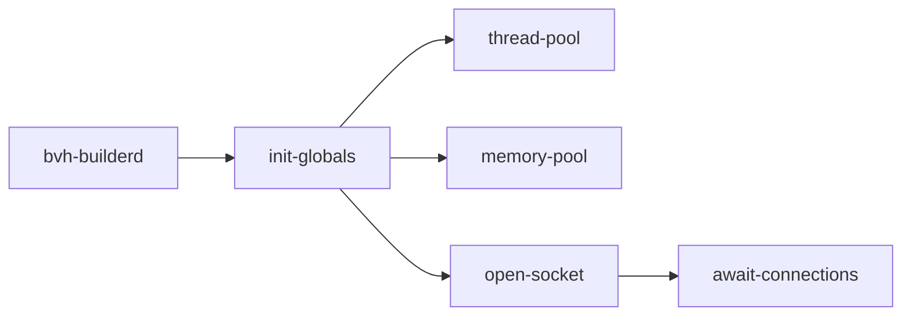
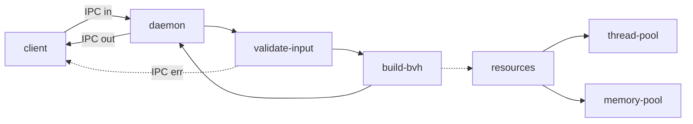

# bvh-builder

CPU BVH builder for assorted rendering applications
in C++23 to run on little-endian machines.

## Features

- **Multi-threaded CPU execution** via internal **fork/join** semantics

- **Safe terminations** with **documented error codes**

- **Persistent resource management** via **socket IPC**

- Average **30M tris/sec** end-to-end throughput on Ryzen 7 8845HS
(included socket IPC and mesh input parsing)

## Architecture Diagrams

### Startup flow

### Usage flow

## Design decisions

### Why a daemon?

A **client-daemon** model was used to improve resource utilization
over long periods of usage. If this was wrapped in an one-shot executable
or API call, thread and memory pools would have to be created and destroyed
for each client request, reducing throughput.

### Why 1 shared thread pool via `wrapper`?

While there is some additional parsing overhead every time `wrapper`
is used as opposed to having a `thread_pool<build_bvh_node>`,
`thread_pool<output_bvh_node>`..., having one shared pool ensures that
threads allocated from the kernel are not wasted.

### Why support many children per node?

Each output BVH node takes up 16 bytes, and as such 4 can be fit per
cache line on most CPUs and GPUs. As a result, storing all children
of a node contiguously can improve cache locality when traversing
the BVH in applications. However, certain applications may perform
better with a different number of children per node, and as such the
option has been left available. Planned: specialised `build_bvh_node`
function for binary BVHs to improve throughput under constraints.

## Build instructions

See `CMakePresets.json` for CMake presets. Syntax: `cmake --preset <preset>`
and `cmake --build --preset <preset>`

### Notes

- Make sure you copy the input file to `build/<preset>`

- If a dependency in `CMakeLists.txt` has updated you must regenerate
`build/<preset>` from scratch

## Usage

Simply run `bvh-builderd` to launch the daemon. Subsequent `bvh-builder`
invocations will read `test.mesh` from the same directory and connect to
the daemon. Support is planned to allow users to provide an argument for
the mesh file name rather than using `test.mesh` as it is a placeholder for now

### Input Format

- `uint32_t verts_len` (number of elements in `verts`)

- `vec<3> *verts` (see [ms1d/vec](https://github.com/ms1d/vec))

- `uint32_t tris_len` (number of triangles in `tris`)

- `vec<3, uint32_t> *tris` (each tri is 3 indices into `verts`).

Note: `tris_len` semantics in code may be incorrect and will be
reviewed during refactors.

### Output Format

- `uint16_t nodes_len` (number of nodes in `nodes`)

- `bvh_node_serialised *nodes` (see `include/structs.hpp`)

## Benchmarks

### End-to-End

All BVH4 benchmarks below were run on Ryzen 7 8845HS (8C/16T).
Measurements were repeated 1000 times. Daemon startup time **NOT** included

| Name | Tris | Avg Time ± S.D. (ms) | Throughput (M tris/sec) |
| --------------- | --------------- | --------------- | --------------- |
| [Stanford Dragon](https://graphics.stanford.edu/data/3Dscanrep/) | ~870k | 30.3 ± 1.3 | 28.7 ± 2.5 |

### Impact on custom resource pools

All BVH4 benchmarks below were run on Ryzen 7 8845HS. [Input model used was the
Stanford Dragon (~870k tri)](https://graphics.stanford.edu/data/3Dscanrep).
Measurements were repeated 1000 times. Daemon startup time **NOT** included.

| Name | Avg Time ± S.D. (ms) | Throughput (M tris/sec) | x baseline |
| --------------- | --------------- | --------------- | --------------- |
| 1T + new/delete (baseline) | 54.0 ± 1.6 | 16.1 ± 1.0 | 1.00 |
| 16T + new/delete | ? ± ? | ? ± ? | ? |
| 1T + memory-pool | 53.1 ± 1.5 | 16.4 ± 0.9 | 1.02 |
| 16T + memory-pool | 30.3 ± 1.3 | 28.7 ± 2.5 | ? |

## AI Usage

AI was used to generate the 2 scripts under `scripts`, `conv_obj.cpp` and
`conv_ply.cpp`. I do not take ownership of these scripts, they are simply
useful for converting popular file formats for benchmark geometry.

## Limitations

- Output has NOT been validated for real applications usage. See issue #12

- No output quality benchmark tool developed

- Basic longest axis splits implemented - SAH binning planned
